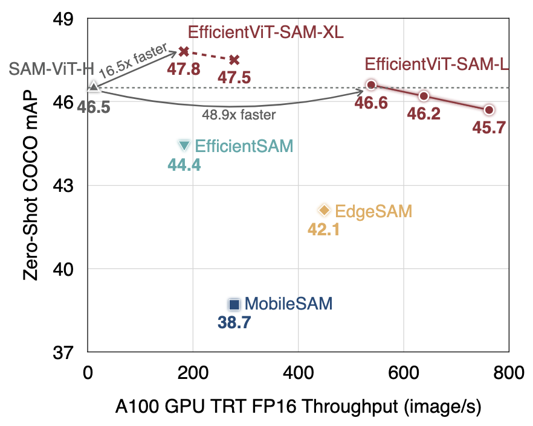
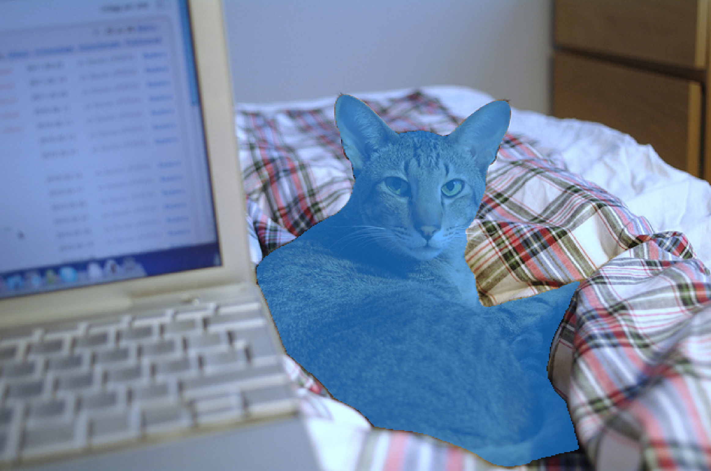

[EfficientViTSAM](https://github.com/mit-han-lab/efficientvit) inference using PyTorch



### Installation

```
conda create -n SAM python=3.8
conda activate SAM
conda install pytorch torchvision torchaudio pytorch-cuda=11.8 -c pytorch -c nvidia
pip install PyYAML
```

### Test

* Run `python main.py --image_path ./demo/cat.jpg --output_path ./demo/cat.png --mode point`

### Results



#### Reference

* https://github.com/mit-han-lab/efficientvit
